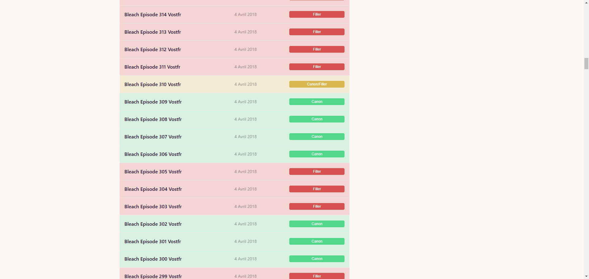
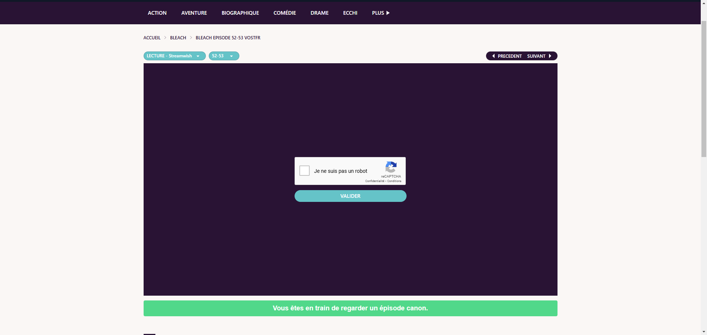

# VoirFiller Chrome Extension





## Description

VoirFiller est une extension Chrome conçue pour détecter si l'épisode que vous regardez sur le site web "[voiranime](https://v3.voiranime.ws)" est un filler ou non. Cette extension est développée avec TypeScript pour garantir une meilleure maintenabilité et robustesse du code.

## Fonctionnalités

-   Détection automatique des épisodes fillers sur "[voiranime](https://v3.voiranime.ws)".
-   Indicateur visuel pour signaler les épisodes fillers.
-   Interface utilisateur intuitive et facile à utiliser.

## Installation

1. Clonez ce dépôt sur votre machine locale.
    ```bash
    git clone https://github.com/votre-utilisateur/voirfiller.git
    ```
2. Accédez au répertoire du projet.
    ```bash
    cd voirfiller
    ```
3. Ouvrez Chrome et accédez à `chrome://extensions/`.
4. Activez le "Mode développeur" en haut à droite.
5. Compilez le projet.
    ```bash
    npm run build
    ```
6. Cliquez sur "Charger l'extension non empaquetée" et sélectionnez le répertoire `dist` du projet.
7. (Provisoire) Le temps que je créer une vraie plateforme pour cette extension afin d'effectuer des requêtes CORS, merci de se rendre sur [cors-anywhere](https://cors-anywhere.herokuapp.com/) et cliquer sur le bouton "Use CORS proxy to bypass the same-origin policy" pour que les requêtes CORS fonctionnent correctement. (A la publication du mode, cette fonctionnalité sera supprimée.)

## Utilisation

1. Accédez au site web "voiranime".
2. Lancez un épisode.
3. L'extension détectera automatiquement si l'épisode est un filler et affichera un indicateur visuel.

## Développement

Pour contribuer au développement de cette extension :

1. Assurez-vous d'avoir Node.js et npm installés.
2. Installez les dépendances du projet.
    ```bash
    npm install
    ```
3. Lancez le projet en mode développement.
    ```bash
    npm run dev
    ```
